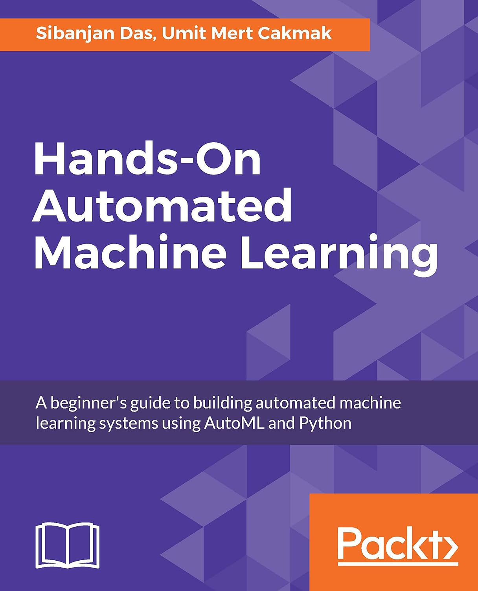

# Awesome AutoML Books

Some of us learn best by reading high quality books on technical topics.

This is a **curated list** of **books** for **engineers** on **development** with **Automated Machine Learning** (AutoML).

## Books:

Alphabetical list of books on AutoML. Each cover/title links to more information about the book.

| Cover | Details |
|-------|---------|
|  | **Title:** Automated Machine Learning **Subtitle:** Methods, Systems, Challenges **Author:** Frank Hutter, Lars Kotthoff, Joaquin Vanschoren **Publisher:** Springer **Star Rating:** 592 |
|  | **Title:** Automated Machine Learning **Subtitle:** Hyperparameter optimization, neural architecture search, and algorithm selection with cloud platforms **Author:** Pavel Brazdil, Jan N. van Rijn, Carlos Soares, Joaquin Vanschoren **Publisher:** Packt **Star Rating:** 19 |
|  | **Title:** Automated Machine Learning and Meta-Learning for Multimedia **Subtitle:**  **Author:** Wenwu Zhu, Xin Wang **Publisher:** Springer **Star Rating:** 0 |
|  | **Title:** Automated Machine Learning for Business **Subtitle:**  **Author:** Kai R. Larsen and Daniel S. Becker **Publisher:** Oxford University **Star Rating:** 4 |
|  | **Title:** Automated Machine Learning in Action **Subtitle:**  **Author:** Qingquan Song, Haifeng Jin, Xia Hu **Publisher:** Manning **Star Rating:** 6 |
|  | **Title:** Automated Machine Learning on AWS **Subtitle:** Fast-track the development of your production-ready machine learning applications the AWS way **Author:** Trenton Potgieter **Publisher:** Packt **Star Rating:** 13 |
|  | **Title:** Automated Machine Learning with AutoKeras **Subtitle:** Deep learning made accessible for everyone with just few lines of coding **Author:** Luis Sobrecueva **Publisher:** Packt **Star Rating:** 11 |
|  | **Title:** Automated Machine Learning with Microsoft Azure **Subtitle:** Build highly accurate and scalable end-to-end AI solutions with Azure AutoML **Author:** Dennis Michael Sawyers **Publisher:** Packt **Star Rating:** 29 |
|  | **Title:** Fun with Machine Learning **Subtitle:** Simplify the Data Science process by automating repetitive and complex tasks using AutoML **Author:** Arockia Liborious and Dr. Rik Das **Publisher:** BPB **Star Rating:** 2 |
|  | **Title:** Hands-On Automated Machine Learning **Subtitle:** A beginner's guide to building automated machine learning systems using AutoML and Python **Author:** Sibanjan Das and Umit Mert Cakmak **Publisher:** Packt **Star Rating:** 3 |
|  | **Title:** Machine Learning Automation with TPOT **Subtitle:** Build, validate, and deploy fully automated machine learning models with Python **Author:** Dario Radečić **Publisher:** Packt **Star Rating:** 5 |
|  | **Title:** Metalearning **Subtitle:** Applications to Automated Machine Learning and Data Mining **Author:** Pavel Brazdil, Jan N. van Rijn, Carlos Soares, Joaquin Vanschoren **Publisher:** Springer **Star Rating:** 10 |
|  | **Title:** Practical Automated Machine Learning on Azure **Subtitle:** Using Azure Machine Learning to Quickly Build AI Solutions **Author:** Deepak Mukunthu, Parashar Shah, Wee Hyong Tok **Publisher:** O’Reilly **Star Rating:** 24 |
|  | **Title:** Practical Automated Machine Learning Using H2O.ai **Subtitle:** Discover the power of automated machine learning, from experimentation through to deployment to production **Author:** Salil Ajgaonkar **Publisher:** Packt **Star Rating:** 5 |
|  | **Title:** Transactional Machine Learning with Data Streams and AutoML **Subtitle:** Build Frictionless and Elastic Machine Learning Solutions with Apache Kafka in the Cloud Using Python **Author:** Sebastian Maurice **Publisher:** APress **Star Rating:** 0 |
|  | **Title:** Up and Running Google AutoML and AI Platform **Subtitle:** Building Machine Learning and NLP Models Using AutoML and AI Platform for Production Environment **Author:** Navin Sabharwal and Amit Agrawal **Publisher:** BPB **Star Rating:** 3 |

### On Curation
The above list is not "all books on AutoML", instead it is filtered using the following procedure:

1. Create a master list of all known books on AutoML (amazon, goodreads, google books, etc.)
2. Read book blurb and table of contents to confirm relevance (for "engineers doing AutoML").
3. Read reviews and check star ratings for quality (quality check).
4. Read comments and discussion about the book on social (twitter/reddit/etc).
5. Acquire the ebook version of the book, if possible (final read/skim to confirm relevance and quality).
6. Final judgement call (publisher, gut check).

Note that I update the list based on newly published books and emails I received about new books.

## Make The List Better
Do you have ideas on how we make this list more awesome?

Email any time: Jason.Brownlee05@gmail.com